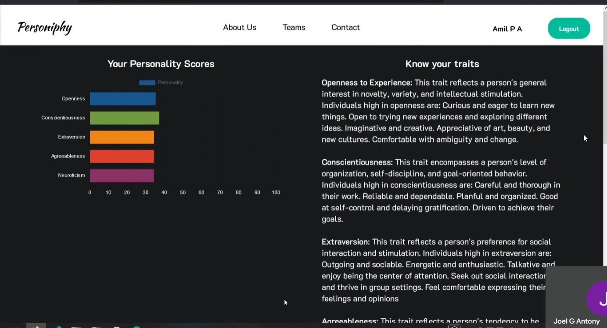

# Personiphy

Personify is a software solution designed to revolutionize human resources by providing
data-driven insights into employee personalities. Through a tailored questionnaire approach,
Personify offers in-depth analysis of individual traits, including those identified by the Big
Five personality framework (OCEAN). This information empowers companies to optimize
hiring practices, fostering a culture of synergy and growth. Personify’s core functionalities
target improved team dynamics through enhanced communication and collaboration based
on personality compatibility. Additionally, employers can leverage these insights to customize
job roles and responsibilities, maximizing individual potential and employee satisfaction. By
deciphering the intricacies of personalities and harnessing this knowledge, Personify paves
the way for a more cohesive and productive work environment.

## Project report

[View pdf](./personiphyteam.pdf)

## Screenshots

